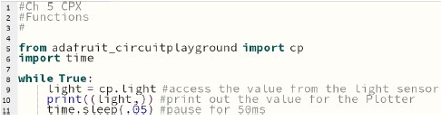
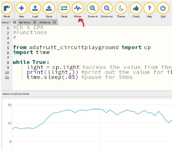
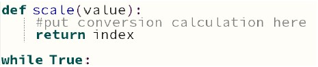

# CPX Measuring Light

### Introduction
This lab uses the built-in light sensor and translates it to a text output, plot and finally plots the
intensity of the light using pixel output

## Procedure
### Part 1 - Characterization of the Light Sensor
-  The following code accesses the value from the light sensor  
  
-  Line 10 prints out the value as a tuple which the Mu Plotter can plot
-  Code this yourself and see the output from the ‘print’ statement by clicking on the Serial
button
-  Click on the Plotter button to see the output as a plot  
  
-  Use a bright light like the flashlight on your phone and shine it on your light sensor
-  Record the highest value with the light on: MAX ___________
-  Cover the sensor and note the lowest value should be zero

### Part 2 - Build the Functions
This part of the lab requires you to create a function that will take the intensity of the light detected and
turn it into a number between 0 and 9 that can then be used to turn on the appropriate pixel. For example if
no light is present pixel A0 would be lit and if the maxium light value is detected pixel A9 would be lit.
- Make a function to scale the light value to the index value
  - Use the following equation to calculate the index  
`𝑖𝑛𝑑𝑒𝑥 = 𝑖𝑛𝑡( 𝑙𝑖𝑔ℎ𝑡𝑉𝑎𝑙𝑢𝑒/𝑀𝐴𝑋 × 𝑚𝑎𝑥𝐼𝑛𝑑𝑒𝑥)`
    - NOTE: The maxIndex value represents the maximum number of unique values in the plot, for the CPX board there
	are 10 pixels but the numbering starts at 0 so you should use the number 9 for maxIndex
  - The function should return the value in the ‘index’ variable
  - The function also have a parameter passed to it
  - Example:    
    
- Build another function which sets all pixels to black
  - Use a ‘for’ loop to loop through the 10 pixels
  - Set each pixel to (0, 0, 0)
  - This is a utility function which doesn’t need any parameters or return an values

### Part 3 - Finishing the Project
-  Modify the code in your main ‘while’ loop to make the light meter
-  Use the ‘scale’ function from Part 2 to return an index value to indicate the light level
-  Use this index to light a specific pixel representing the intensity of the light detected
  - You may need to turn off all the pixels before you light this one!!! Just a small
hint
  - Make sure your pause very briefly to let things settle
  - Check out this [video](https://www.youtube.com/shorts/PSz1E3-uFn8) for an example

### Turn-in
-  Save your code to this repo and push
-  Upload a short video demonstrating the flashing lights (remote only)

### Grading
- Proper use of comments
- Coding of a ‘scale’ function
- Coding of a function to turn off the pixels
- Final working project
- Video demonstrating working project
